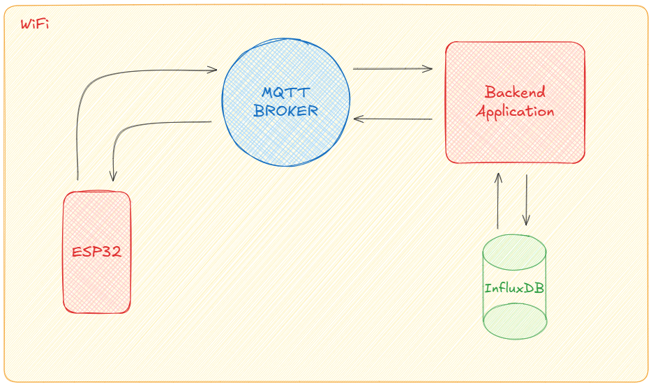
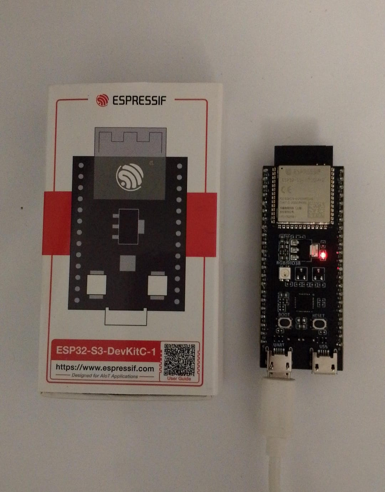
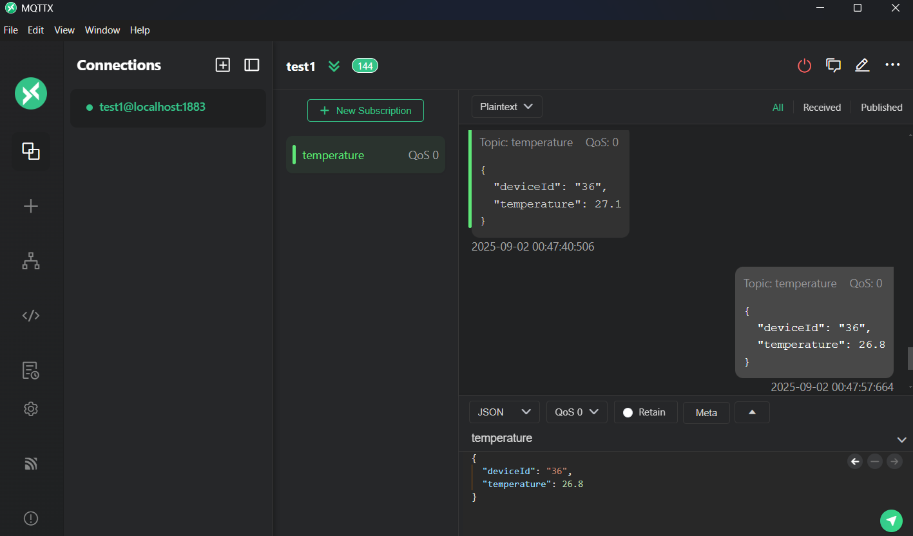
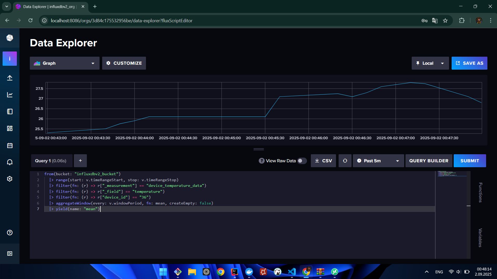
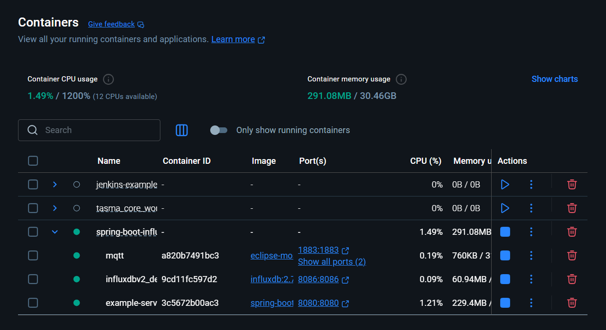
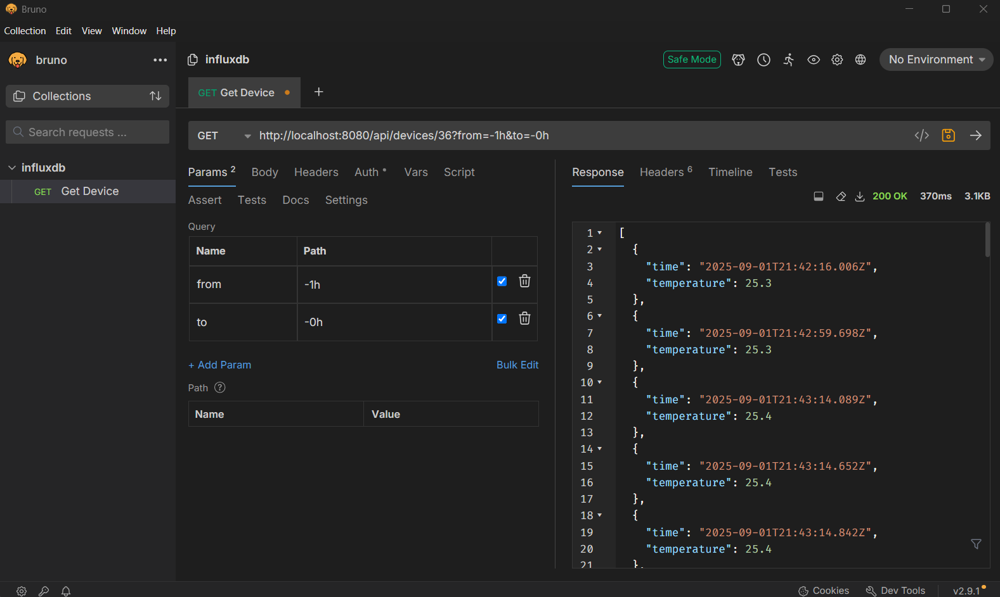

# 🌐 IoT InfluxDB Example

<div align="center">
  <h3>⚡ Architecture Schema</h3>
  
</div>

<br>

<details>
<summary>🌡️ ESP32</summary>

</details>

<br>

<details>
<summary>💬 MQTT</summary>

</details>

<br>

<details>
<summary>📊 InfluxDB</summary>

</details>

<br>

<details>
<summary>🐳 Docker</summary>

</details>

<br>

<details>
<summary>🧪 Postman</summary>

</details>

<br>

## 📖 About

✅ This project demonstrates how to collect, store, and analyze temperature data from ESP32 microcontrollers via MQTT protocol into InfluxDB, a time series database.

<br>

## 🛠️ Technologies Used

[](https://www.espressif.com/)
[](https://mqtt.org/)
[](https://www.influxdata.com/)
[](https://spring.io/projects/spring-boot)
[](https://www.oracle.com/java/)
[](https://www.docker.com/)

<br>

## ⚙️ ESP32 Configuration

```ino
const char* ssid = "<WIFI_NAME>";
const char* password = "<WIFI_PASSWORD>";
const char* mqtt_server = "<MQTT_SERVER_IP>";
```

<br>

## 🚀 Getting Started

```bash
cd iot-influxdb-example
```

```bash
docker-compose up -d
```

<br>

## 📡 InfluxDB API Endpoints

### 🔍 Get Temperatures

```bash
curl -X 'GET' \
  'http://localhost:8080/api/devices/36?from=-1h' \
  -H 'accept: application/json'
```

<br>

# License

This project is licensed under the MIT License. See the [LICENSE](LICENSE) file for details

Created by [Mehmet Furkan KAYA](https://www.linkedin.com/in/mehmet-furkan-kaya/)
